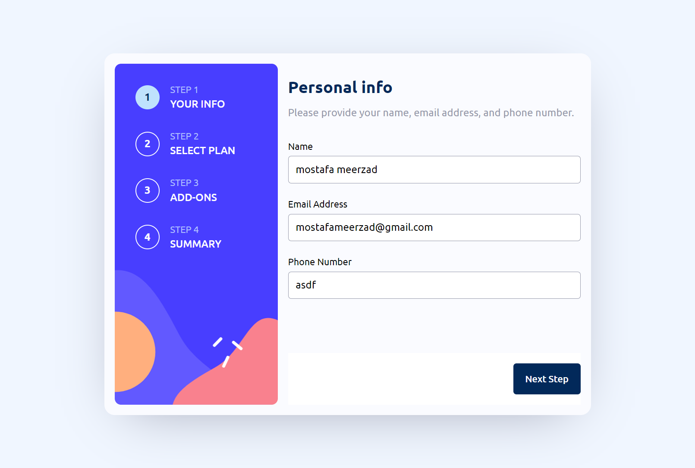

# Frontend Mentor - Multi-step form solution

This is a solution to the [Multi-step form challenge on Frontend Mentor](https://www.frontendmentor.io/challenges/multistep-form-YVAnSdqQBJ). Frontend Mentor challenges help you improve your coding skills by building realistic projects.

## Table of contents

- [Frontend Mentor - Multi-step form solution](#frontend-mentor---multi-step-form-solution)
  - [Table of contents](#table-of-contents)
  - [Overview](#overview)
    - [The challenge](#the-challenge)
    - [Screenshot](#screenshot)
    - [Links](#links)
  - [My process](#my-process)
    - [Built with](#built-with)
  - [Author](#author)

## Overview

### The challenge

Users should be able to:

- Complete each step of the sequence
- See a summary of their selections on the final step and confirm their order
- View the optimal layout for the interface depending on their device's screen size
- See hover and focus states for all interactive elements on the page

### Screenshot

### Links

- Solution URL: [github](https://github.com/mostafa-meerzad/multi-step-form.git)
- Live Site URL: [netlify](https://65474dc917130a24e7ac7ab8--joyful-hummingbird-5544d6.netlify.app/)

## My process

### Built with

- Semantic HTML5 markup
- Flexbox
- CSS Grid
- Mobile-first workflow
- Scss
- [React](https://reactjs.org/) - JS library
- [React Hook Form](https://www.react-hook-form.com/) - JS library for creating forms

## Author

- Linkedin - [mostafa-meerzad](https://linkedin.com/in/mostafa-meerzad-a753371b7)
- Github - [mostafa-meerzad](https://github.com/mostafa-meerzad)
- Frontend-mentor - [mostafa-meerzad](https://www.frontendmentor.io/profile/mostafa-meerzad)
